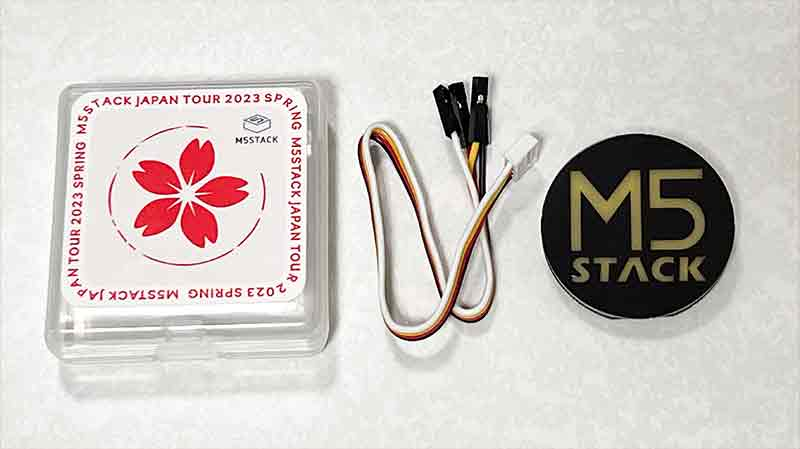
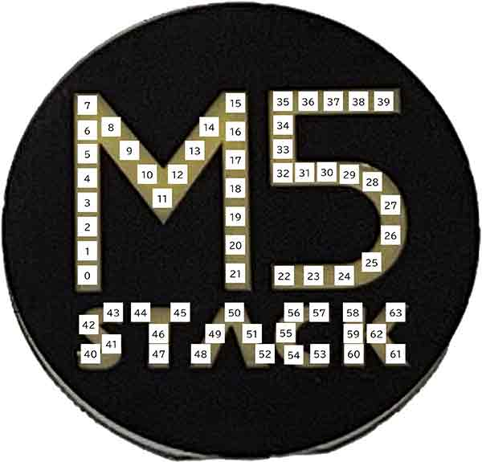

# M5Badge用サンプルプログラム

M5JPTour2023で配布されたM5Badgeを利用するサンプルプログラムを置いています。

## UIFlow2用

ATOMS3にM5Badgeを接続してUIFlow2 Alpha-11で動作確認をしています。

### LED位置表示（`m5badge-led-position.m5f2`）

M5Badgeに搭載されている64個のLEDを順番に表示します。

ATOMS3のボタンを押しながら起動すると自動モード，押さなかった場合は手動モードになります。

自動モードの場合，LED 0から63まで順次表示します。手動モードの場合，M5Badgeの右上にあるボタンを押すと0から63まで順次表示し，ATOMS3のボタンを押すと逆方向で表示します。
